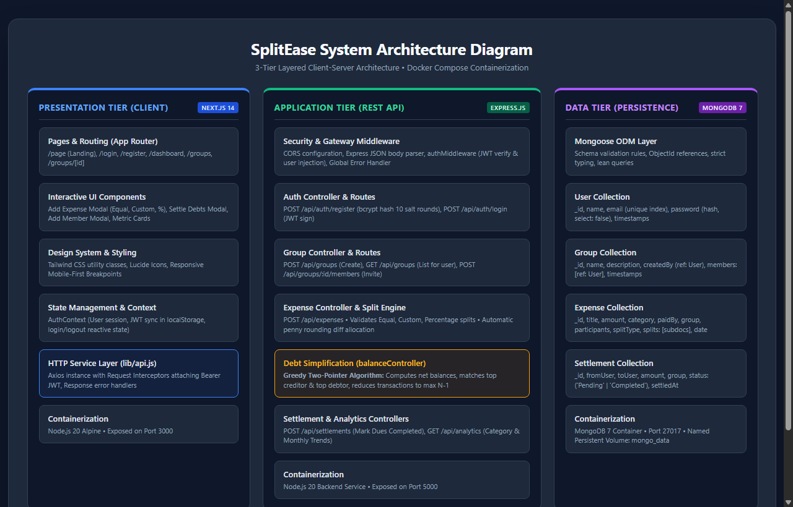
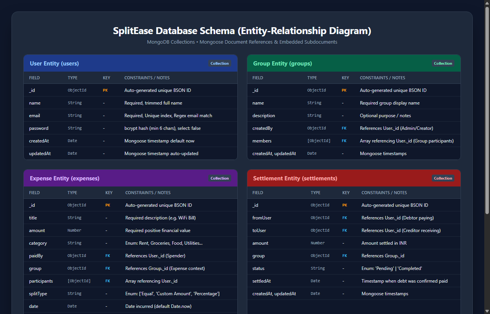
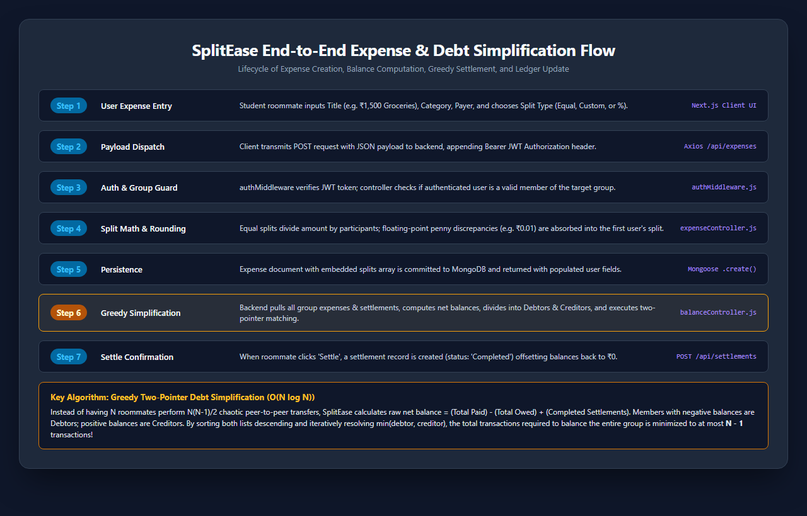
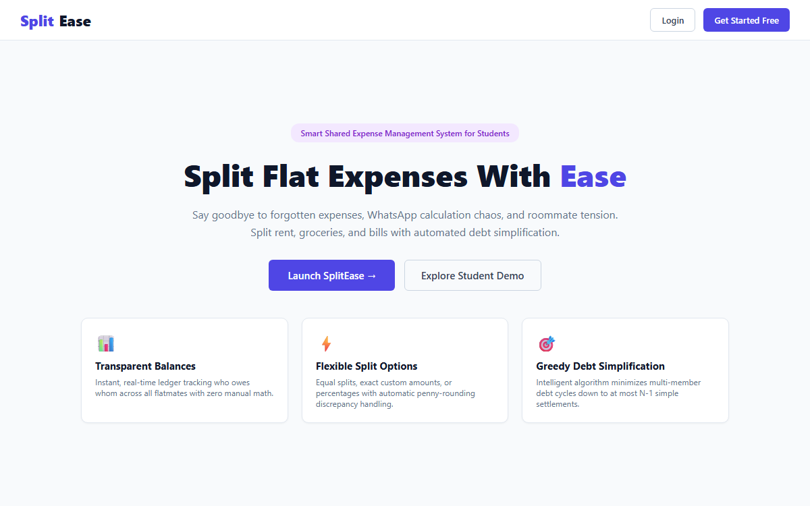
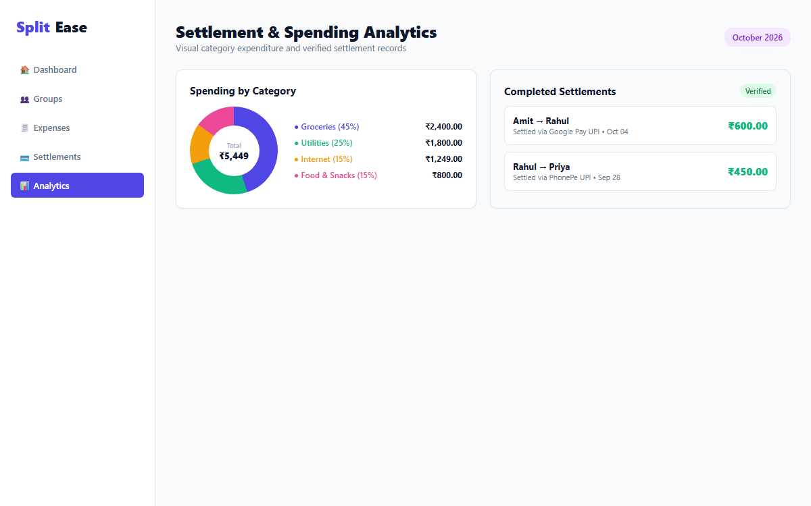

# SplitEase – Smart Shared Expense Management System for Students

## Project Overview

SplitEase is a web-based shared expense management system designed to help students and roommates efficiently manage group expenses. It provides a centralized platform where users can create groups, record shared expenses, automatically split bills, track balances, and settle dues transparently.

Instead of relying on spreadsheets, chat messages, or manual calculations, SplitEase automates expense tracking and balance computation, reducing confusion and ensuring fairness among all group members.

---

## Problem it Solves

Managing shared expenses in student accommodations such as flats, hostels, or PGs is often challenging. Daily expenses including rent, groceries, electricity bills, internet charges, food orders, and household purchases are typically recorded in WhatsApp chats, notebooks, or remembered mentally.

These traditional methods often result in:

- Forgotten expenses
- Incorrect manual calculations
- Lack of transparency
- Missed or delayed payments
- Frequent disputes among roommates

SplitEase eliminates these problems by maintaining a single source of truth for all shared expenses and automatically calculating individual balances.

---

## Target Users (Personas)

### Rahul – Flat Resident (Age: 20)
Rahul frequently pays for groceries and food orders on behalf of his roommates. He wants a quick and easy way to record expenses and immediately know how much each roommate owes him.

**Goals:**
- Add expenses within seconds
- Avoid manual calculations
- Track pending payments

---

### Priya – Group Organizer (Age: 21)
Priya manages a four-member apartment and wants complete visibility of the group's monthly spending. She needs organized reports and accurate balance summaries.

**Goals:**
- Manage group expenses efficiently
- View monthly spending reports
- Ensure everyone pays fairly

---

### Admin / Group Creator
The administrator creates the expense group, invites members, manages group information, and monitors overall spending.

**Goals:**
- Create and manage groups
- Add or remove members
- Maintain transparency across the group

---

## Vision Statement

To become the simplest and most reliable expense-sharing platform for students and small groups by providing transparent expense tracking, automatic balance calculations, and hassle-free settlement management.

---

## Key Features / Goals

- Secure user registration and authentication (JWT & bcrypt)
- Create and manage multiple expense groups
- Add shared expenses with descriptions and categories
- Automatically split expenses equally, by custom amount, or by percentage
- Real-time balance calculation for every member
- Track who owes whom
- Greedy Two-Pointer Debt Simplification (minimizes cash transactions)
- View expense history with filters and categories
- Monthly spending analytics and visual charts
- Settle outstanding balances by marking payments as completed
- Responsive interface accessible from desktop and mobile browsers

---

## Success Metrics

The project will be considered successful if it achieves the following objectives:

- Users can record a new expense in under 10 seconds.
- Balance calculations remain 100% accurate across all test scenarios.
- Users can clearly identify pending dues without manual calculations.
- At least three sample groups successfully manage one month of expenses.
- Dashboard loads within two seconds under normal usage.
- Users can complete the expense settlement process with minimal interaction.

---

## Assumptions & Constraints

### Assumptions
- All members honestly record expenses.
- Internet connectivity is available while using the application.
- Each user belongs to at least one expense group.
- Users are familiar with basic web applications.

### Constraints
- No real payment gateway integration (settlements are recorded manually via off-chain UPI/cash).
- Supports only Indian Rupees (INR) in the current version.
- Designed for small groups containing 2–8 members.
- Web application only (no native Android or iOS application in MVP).
- Internet connection is required.
- Receipt scanning and OCR are outside the scope of the MVP.

---

## MoSCoW Prioritization

### Must Have (M)
These are essential features without which the application cannot function.

| Feature | Reason |
|---------|--------|
| User Registration & Login | Required for secure access |
| Create Expense Groups | Core functionality |
| Add Members to Group | Enables shared expenses |
| Add Shared Expense | Primary feature |
| Equal Expense Split | Core calculation |
| Custom Expense Split | Supports flexible sharing |
| Automatic Balance Calculation | Eliminates manual calculations |
| Dashboard Overview | Displays user balances |
| Expense History | Tracks previous expenses |
| Settle Outstanding Payments | Completes expense lifecycle |

---

### Should Have (S)
Important features that improve usability but are not essential for the MVP.

| Feature | Reason |
|---------|--------|
| Edit Expense | Correct mistakes |
| Delete Expense | Remove incorrect entries |
| Expense Categories | Better organization |
| Monthly Expense Summary | Spending analysis |
| Spending Charts | Better visualization |
| Group Management | Modify group information |
| Settlement History | View completed payments |

---

### Could Have (C)
Useful enhancements that improve user experience.

| Feature | Reason |
|---------|--------|
| Receipt Upload | Store bill images |
| Dark Mode | Better UI experience |
| Budget Tracking | Monitor monthly spending |
| Pending Payment Reminders | Improve settlements |
| Profile Picture | Personalization |
| Search & Filter Expenses | Easier navigation |

---

### Won't Have (W)
Features intentionally excluded from the first release.

| Feature | Reason |
|---------|--------|
| Online Payment Gateway | Outside project scope |
| UPI Integration | Future enhancement |
| Mobile Application | Web-only project |
| Multi-Currency Support | INR only |
| OCR Receipt Scanning | Future work |
| AI Spending Prediction | Advanced feature |

---

## Software Design

> **Main Design Choices Summary:**  
> SplitEase follows a decoupled **3-Tier Layered Client-Server Architecture** (Next.js 14 App Router, Express.js REST API, and MongoDB with Docker Compose) to enforce strict separation of concerns and independent service scalability. A **Greedy Two-Pointer Debt Simplification Algorithm** ($O(N \log N)$) was chosen to compress multi-party debts into at most $N-1$ direct settlements, preventing chaotic pairwise money transfers. Furthermore, a **document-oriented NoSQL model** with embedded subdocument arrays was adopted to support dynamic Equal, Custom, and Percentage splits in a single atomic database read without expensive SQL relational joins.

### System Architecture Diagram
The high-level architecture diagram illustrates the Presentation Tier, Application Logic Tier, and Data Persistence Tier, containerized within a shared Docker network bridge:



- **Editable Draw.io File:** [`docs/design/architecture.drawio`](docs/design/architecture.drawio)
- **High-Resolution PNG:** [`docs/design/architecture-diagram.png`](docs/design/architecture-diagram.png)

---

### Database Schema (Entity-Relationship Diagram)
The data architecture models four core Mongoose entities: `User`, `Group`, `Expense`, and `Settlement`, utilizing embedded subdocument arrays for expense split allocations:



- **Editable Draw.io File:** [`docs/design/database-schema.drawio`](docs/design/database-schema.drawio)
- **High-Resolution PNG:** [`docs/design/database-schema.png`](docs/design/database-schema.png)

---

### Core System Sequence Flow
The end-to-end flow from expense entry, through JWT verification and penny-rounding adjustment, to greedy two-pointer debt minimization and ledger settlement:



- **Editable Draw.io File:** [`docs/design/system-flow.drawio`](docs/design/system-flow.drawio)
- **High-Resolution PNG:** [`docs/design/system-flow.png`](docs/design/system-flow.png)

---

### User Interface Design & Figma Prototype

The user interface was crafted in Figma with student ergonomics in mind: instantaneous balance awareness, semantic debt colors (Green for credit, Red for debit), and zero visual friction.

- **Figma Interactive Prototype:** [SplitEase Figma Prototype (Starter Plan)](https://www.figma.com/proto/splitease-shared-expenses/SplitEase-UI-Prototype)
- **Design Tokens & Specs:** [`docs/design/figma_prototype.md`](docs/design/figma_prototype.md)

| Screen 1: Landing Page | Screen 2: Authentication |
|:---:|:---:|
|  |  |
| **Screen 3: Dashboard Overview** | **Screen 4: Group Details & Activity** |
|  |  |
| **Screen 5: Add Expense & Split Modal** | **Screen 6: Settlement & Analytics** |
|  |  |

---

### Software Design Document (SDD) Deliverables
- **Compiled PDF (10 Pages Max):** [`docs/design/Software_Design_Document.pdf`](docs/design/Software_Design_Document.pdf)
- **Markdown Version:** [`docs/design/Software_Design_Document.md`](docs/design/Software_Design_Document.md)
- **HTML Source:** [`docs/design/Software_Design_Document.html`](docs/design/Software_Design_Document.html)

---

## Tech Stack

- **Frontend**: Next.js 14 (App Router), React 18, Tailwind CSS, Axios, Lucide React Icons.
- **Backend**: Node.js 20, Express.js REST API, JSON Web Tokens (JWT), bcrypt.js.
- **Database**: MongoDB 7.0 Community Server (Mongoose ODM).
- **DevOps & Containers**: Docker, Docker Compose (`client`, `server`, `mongo`).
- **Design & Diagrams**: Figma (UI Prototype), Diagrams.net / Draw.io (Architecture & ERD).

---

## Project Structure

```
SplitEase/
├── client/                     # Next.js frontend application
│   ├── app/                    # App router pages & layouts
│   │   ├── (auth)/             # Login & Register views
│   │   ├── (dashboard)/        # Dashboard & Group management views
│   │   └── page.js             # Landing page
│   ├── components/             # Reusable UI component library (Button, Card, Input, Sidebar)
│   ├── context/                # Client state (AuthContext)
│   ├── lib/                    # Axios API client & utility helpers
│   └── Dockerfile
├── server/                     # Node.js/Express backend REST API
│   ├── src/
│   │   ├── config/             # Database connection (Mongoose)
│   │   ├── controllers/        # Business logic controllers (auth, expense, balance, settlement)
│   │   ├── middleware/         # JWT authentication & route guards
│   │   ├── models/             # Mongoose schemas (User, Group, Expense, Settlement)
│   │   ├── routes/             # Express API route declarations
│   │   └── index.js            # Server entry point
│   └── Dockerfile
├── docs/                       # Project documentation & design assets
│   └── design/                 # Official Software Design Assets
│       ├── architecture-diagram.png
│       ├── architecture.drawio
│       ├── database-schema.png
│       ├── database-schema.drawio
│       ├── system-flow.png
│       ├── system-flow.drawio
│       ├── figma_prototype.md
│       ├── Software_Design_Document.pdf  # (10-Page Design Document)
│       ├── Software_Design_Document.md
│       └── screens/            # 6 High-Fidelity Figma UI screens (PNG)
├── design/                     # Root alias for design folder
├── docker-compose.yml          # Multi-container orchestration
└── README.md                   # Project documentation
```

---

## Branching Strategy

This project follows **GitHub Flow**:

- `main` is always deployable/stable.
- New work happens on feature branches named `feature/<short-description>` (e.g. `feature/expense-split-logic`, `feature/auth-jwt`).
- Bug fixes use `fix/<short-description>`.
- Commit early, push often, open a Pull Request into `main` when ready.
- PRs are reviewed (self-review is fine for solo project) before merging.
- Delete the branch after merging to keep things clean.

Example:
```bash
git checkout -b feature/expense-split-logic
# make changes
git add .
git commit -m "feat: add equal and custom expense split logic"
git push origin feature/expense-split-logic
# open PR on GitHub, merge into main
```

---

## Local Development Tools

- **Node.js**: v20.x or v24.x
- **Package manager**: npm
- **Frontend**: Next.js (App Router), Tailwind CSS
- **Backend**: Node.js + Express
- **Database**: MongoDB (via Docker container or local instance)
- **Containerization**: Docker + Docker Compose
- **Code editor**: VS Code
- **API testing**: Postman / Thunder Client
- **Version control**: Git + GitHub

---

## Quick Start – Local Development

### Prerequisites
- Docker Desktop installed and running
- Git installed

### Steps (With Docker)

1. Clone the repository:
```bash
git clone https://github.com/OG-Shrish/SplitEase-Smart-Shared-Expense-Management-System-for-Students.git
cd SplitEase
```

2. Create a `.env` file inside `server/` with:
```
MONGO_URI=mongodb://mongo:27017/splitease
JWT_SECRET=your_jwt_secret_here
PORT=5000
```

3. Build and start all services with Docker Compose:
```bash
docker-compose up --build
```

4. Once running, access:
- **Frontend**: [http://localhost:3000](http://localhost:3000)
- **Backend API**: [http://localhost:5000](http://localhost:5000)

5. To stop all services:
```bash
docker-compose down
```

### Running without Docker (Optional local testing)

```bash
# Terminal 1 - backend
cd server
npm install
# Set MONGO_URI=mongodb://localhost:27017/splitease & JWT_SECRET in server/.env
npm run dev

# Terminal 2 - frontend
cd client
npm install
npm run dev
```

---

## API Overview

- `POST /api/auth/register` - Register a new user
- `POST /api/auth/login` - Authenticate user and receive JWT
- `POST /api/groups` - Create a new expense group
- `GET /api/groups` - Get all groups for authenticated user
- `POST /api/groups/:id/members` - Invite a roommate by email
- `POST /api/expenses` - Create a shared expense (Equal, Custom Amount, Percentage)
- `GET /api/expenses/group/:groupId` - Get chronological expense log for group
- `GET /api/balances/group/:groupId` - Get raw net balance ledger
- `GET /api/balances/group/:groupId/simplify` - Run Greedy Two-Pointer algorithm to get simplified debts
- `POST /api/settlements` - Record and confirm debt repayment
- `GET /api/analytics/group/:groupId` - Get categorical spending analytics

---

## Contributors
- ABHIJEET AND SHRISH
