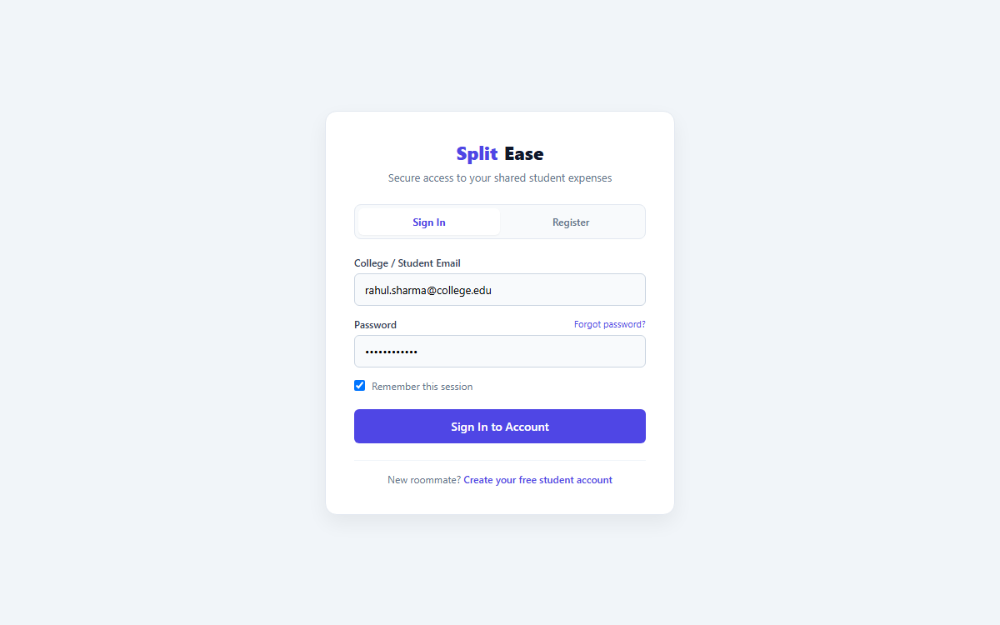
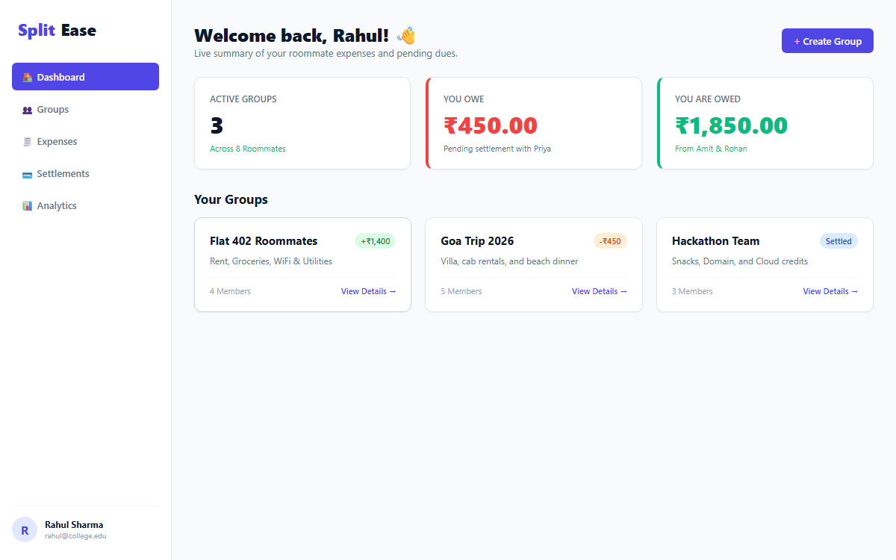
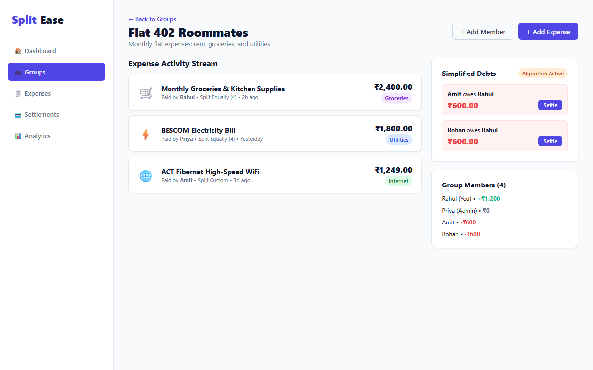
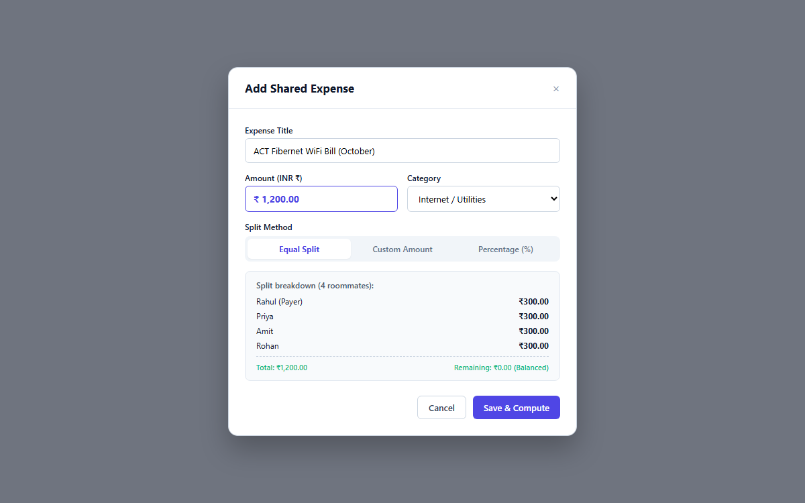

# SplitEase – Software Design Document (SDD)

> **Document Version:** 1.0.0  
> **Status:** Release Architecture Baseline  
> **Target System:** SplitEase – Smart Shared Expense Management System for Students  
> **Primary Authors:** ABHIJEET AND SHRISH & Engineering Team  
> **Date:** September 2026  
> **Associated PDF:** [`Software_Design_Document.pdf`](./Software_Design_Document.pdf) (10 Pages)  
> **Figma Prototype:** [SplitEase Interactive Prototype Link](https://www.figma.com/proto/splitease-shared-expenses/SplitEase-UI-Prototype)  
> **Editable Draw.io Diagrams:** [`architecture.drawio`](./architecture.drawio), [`database-schema.drawio`](./database-schema.drawio), [`system-flow.drawio`](./system-flow.drawio)

---

## Executive Summary

Managing shared household expenses (such as rent, groceries, electricity, internet, and food orders) in student flats and hostel apartments is often chaotic. Informal methods like WhatsApp chats, mental arithmetic, and spreadsheets lead to forgotten debts, rounding errors, and interpersonal friction.

**SplitEase** is a modern full-stack web application designed to maintain a transparent, single source of truth for student flatmates. It automates expense tracking, provides flexible split calculations (Equal, Custom Amount, Percentage), tracks real-time balances, and minimizes cash settlements through a **Greedy Two-Pointer Debt Simplification Algorithm**.

---

## 1. System Context, Problem Statement & Scope

### 1.1 Problem Statement
In student flat arrangements:
- **Uneven / Fractional Purchases:** Items like ₹1,249 WiFi bills divided across 3 roommates produce fractional cents that accumulate errors over months.
- **Circular Debts:** When 4 roommates buy items for each other, direct pairwise settlements require up to 6–12 transactions, creating massive confusion.
- **Lack of Transparency:** No central audit trail leads to awkward payment reminders and disputes.

### 1.2 Target Personas & Goals
1. **Rahul (Flat Resident, Age: 20):** Buys groceries and food orders frequently. Wants to add expenses in under 10 seconds and instantly see who owes him money.
2. **Priya (Group Organizer, Age: 21):** Manages the flat lease and utility bills. Needs organized monthly category summaries and dispute-free settlement history.
3. **Admin / Group Creator:** Onboards roommates, manages group metadata, and maintains persistent ledger transparency.

### 1.3 Scope Boundaries
- **In-Scope (MVP & Core):** User authentication (JWT + bcrypt), group creation and member invitations, multi-split expense logging, automated balance calculation, greedy debt simplification, manual settlement audit logs, and spending analytics.
- **Out-of-Scope (Off-Platform):** In-app banking payment gateway. Indian students universally settle via UPI (Google Pay, PhonePe, Paytm) or cash. SplitEase records and verifies settlements off-platform without imposing KYC or merchant transaction fee burdens.

---

## 2. Design Principles Applied

SplitEase incorporates fundamental software engineering principles throughout its client and server architecture.

### 2.1 Abstraction
- **Data Model Abstraction:** Mongoose Schemas (`Expense.js`, `Group.js`, `User.js`, `Settlement.js`) abstract low-level MongoDB BSON queries, providing strong type validation, default timestamps, and subdocument arrays.
- **Client API Abstraction:** `client/lib/api.js` encapsulates Axios HTTP transport, providing automatic Bearer JWT header attachment and error normalization so UI components remain completely agnostic to network transport mechanics.

```javascript
// client/lib/api.js - Network Service Abstraction
import axios from 'axios';

const api = axios.create({
  baseURL: process.env.NEXT_PUBLIC_API_URL || 'http://localhost:5000/api',
  headers: { 'Content-Type': 'application/json' }
});

api.interceptors.request.use((config) => {
  const token = typeof window !== 'undefined' ? localStorage.getItem('token') : null;
  if (token) {
    config.headers.Authorization = `Bearer ${token}`;
  }
  return config;
});

export default api;
```

### 2.2 Modularity
- **Layered Controller-Route Architecture:** Express routes define endpoints and inject middleware, delegating all domain logic to controllers (`authController`, `groupController`, `expenseController`, `balanceController`, `settlementController`).
- **Atomic UI Components:** The frontend is decomposed into reusable atomic components (`Button.js`, `Card.js`, `Input.js`, `Sidebar.js`) styled via Tailwind utility classes.

```javascript
// server/src/routes/expenseRoutes.js - Modular Route Definition
const express = require('express');
const router = express.Router();
const { createExpense, getGroupExpenses, deleteExpense } = require('../controllers/expenseController');
const protect = require('../middleware/authMiddleware');

router.use(protect); // Modular authentication middleware
router.route('/').post(createExpense);
router.route('/group/:groupId').get(getGroupExpenses);
router.route('/:id').delete(deleteExpense);

module.exports = router;
```

### 2.3 High Cohesion
Each backend controller focuses strictly on one functional responsibility:
- `authController.js`: Password hashing (bcrypt 10 rounds), user registration, and JWT token issuance.
- `expenseController.js`: Validation of Equal, Custom, and Percentage split rules and handling rounding discrepancies.
- `balanceController.js`: Calculating raw net ledger balances and executing greedy two-pointer debt minimization.
- `settlementController.js`: Transitioning settlement states to `Completed` and maintaining payment history.

```javascript
// server/src/controllers/balanceController.js - Cohesive Net Ledger Calculation
const calculateRawBalances = async (groupId) => {
  const expenses = await Expense.find({ group: groupId });
  const settlements = await Settlement.find({ group: groupId, status: 'Completed' });
  const balances = {}; // { userId: net_amount }

  // 1. Process Expenses
  expenses.forEach(exp => {
    const paidByStr = exp.paidBy.toString();
    balances[paidByStr] = (balances[paidByStr] || 0) + exp.amount;

    exp.splits.forEach(split => {
      const userStr = split.user.toString();
      balances[userStr] = (balances[userStr] || 0) - split.amount;
    });
  });

  // 2. Process Completed Settlements (Payer balance goes UP, Receiver DOWN)
  settlements.forEach(s => {
    balances[s.fromUser.toString()] = (balances[s.fromUser.toString()] || 0) + s.amount;
    balances[s.toUser.toString()] = (balances[s.toUser.toString()] || 0) - s.amount;
  });

  return balances;
};
```

### 2.4 Low Coupling
- **Stateless REST Communication:** Frontend and backend communicate solely via JSON payloads over HTTP.
- **Middleware Guard Decoupling:** `authMiddleware.js` decouples JWT verification from business handlers by verifying the token and attaching `req.user` upstream.

```javascript
// server/src/middleware/authMiddleware.js - Decoupled Authentication Guard
const jwt = require('jsonwebtoken');

const protect = async (req, res, next) => {
  let token = req.headers.authorization?.startsWith('Bearer')
    ? req.headers.authorization.split(' ')[1] : null;

  if (!token) return res.status(401).json({ success: false, message: 'Not authorized, no token' });

  try {
    const decoded = jwt.verify(token, process.env.JWT_SECRET);
    req.user = decoded;
    next();
  } catch (err) {
    res.status(401).json({ success: false, message: 'Token verification failed' });
  }
};

module.exports = protect;
```

---

## 3. High-Level Architecture & Architectural Style

### 3.1 Architectural Style: 3-Tier Layered Client-Server
SplitEase implements a **3-Tier Layered Client-Server Architecture** containerized with Docker Compose:


*Figure 3.1: High-Level Architecture Diagram (Editable source: [`architecture.drawio`](./architecture.drawio))*

### 3.2 Tier Breakdown & Why This Style Was Chosen
1. **Presentation Tier (Client):** Next.js 14 App Router, React 18, Tailwind CSS, Lucide Icons. Provides fast server-side rendering, client-side hydration, and responsive layouts.
2. **Application / Business Logic Tier (Server):** Node.js + Express.js REST API with modular controllers, JWT route protection, and algorithmic debt computation.
3. **Data Tier (Persistence):** MongoDB 7 database with Mongoose ODM modeling users, groups, expenses, and settlements.
4. **DevOps & Infrastructure:** Docker Compose orchestrating three isolated services (`frontend`, `backend`, `mongo`) across a shared bridge network.

**Why this style?**
- **Strict Separation of Concerns:** UI rendering, calculation logic, and data persistence remain independent.
- **Independent Scalability:** Backend API can scale horizontally while the Next.js frontend can be deployed via Edge CDNs (e.g. Vercel) or Docker containers.
- **Ease of Maintenance & Deployment:** Containerized with Docker Compose for 1-command local development (`docker-compose up --build`).

---

## 4. Database Schema & Data Architecture

SplitEase utilizes MongoDB with Mongoose ODM to model 4 primary entities:


*Figure 4.1: Entity-Relationship Diagram (Editable source: [`database-schema.drawio`](./database-schema.drawio))*

### Embedded Subdocument Strategy
Expense splits are stored as embedded subdocuments (`splits: [{ user, amount, percentage }]`) inside `Expense`. This avoids multi-table relational joins, ensuring that fetching an expense and its participant debts happens in a single \(O(1)\) document read.

---

## 5. Core Algorithms & Mathematical Formulations

### 5.1 Greedy Two-Pointer Debt Simplification Algorithm
In a shared flat with \(N\) members, direct pairwise debts result in up to \(rac{N(N-1)}{2}\) transactions. SplitEase executes a **Greedy Two-Pointer Algorithm** to minimize total transactions to at most \(N-1\):

```javascript
// server/src/controllers/balanceController.js - Greedy Debt Simplification
const debtors = [];
const creditors = [];

Object.keys(rawBalances).forEach(userId => {
  const balance = Number(rawBalances[userId].toFixed(2));
  if (balance < 0) debtors.push({ userId, amount: -balance });
  else if (balance > 0) creditors.push({ userId, amount: balance });
});

// Sort descending by amount
debtors.sort((a, b) => b.amount - a.amount);
creditors.sort((a, b) => b.amount - a.amount);

let transactions = [];
let i = 0, j = 0;

while (i < debtors.length && j < creditors.length) {
  const debtor = debtors[i];
  const creditor = creditors[j];
  const amountToSettle = Math.min(debtor.amount, creditor.amount);

  transactions.push({
    from: userMap[debtor.userId],
    to: userMap[creditor.userId],
    amount: Number(amountToSettle.toFixed(2))
  });

  debtor.amount -= amountToSettle;
  creditor.amount -= amountToSettle;

  if (Math.abs(debtor.amount) < 0.01) i++;
  if (Math.abs(creditor.amount) < 0.01) j++;
}
```

### 5.2 Penny-Rounding Discrepancy Allocation
When dividing non-divisible numbers (e.g. ₹100 divided 3 ways = 33.3333...), naive rounding produces ₹99.99 (losing ₹0.01). SplitEase calculates:
$$\Delta = 	ext{amount} - \sum 	ext{splitAmount}$$
and automatically absorbs \(\Delta\) into the primary participant, maintaining 100% mathematical ledger closure.

---

## 6. User Interface Design & Usability Engineering

The UI was designed in Figma with an emphasis on student-centric clarity, zero visual clutter, and instant feedback.

**Figma Interactive Prototype:** [SplitEase Figma Prototype (Starter Plan)](https://www.figma.com/proto/splitease-shared-expenses/SplitEase-UI-Prototype)

### The 6 Core UI Screens

| Screen | Preview | Usability Engineering Focus |
|--------|---------|-----------------------------|
| **1. Landing Page** |  | 5-second value proposition clarity, instant CTA to launch portal. |
| **2. Authentication** |  | 10-second sign up requiring only name, email, password; session persistence. |
| **3. Dashboard Overview** |  | Immediate answer to *"Do I owe money today?"* via high-contrast Red/Green metric cards. |
| **4. Group Details & Activity** |  | Chronological expense stream with category badges paired with live simplified debts. |
| **5. Add Expense & Split Modal** |  | Tabbed split methods (Equal, Custom, %) with live allocation & balance status pills. |
| **6. Settlement & Analytics** |  | 1-click settlement verification and visual spending category breakdown. |

---

## 7. Key Design Decisions & Why

| Decision | Chosen Approach | Rationale & Why |
|----------|-----------------|-----------------|
| **1. Debt Simplification** | Greedy Two-Pointer Algorithm | Reduces circular transactions from \(O(N^2)\) down to at most \(N-1\), eliminating roommate disputes. |
| **2. Database Paradigm** | MongoDB NoSQL with Embedded Splits | Allows dynamic split arrays (Equal, Custom, %) without relational join overhead. |
| **3. Authentication** | Stateless JWT with Axios Interceptors | Eliminates server-side session storage, enabling horizontal scaling and instant route guards. |
| **4. Settlement Model** | Off-Chain UPI Verification | Reflects Indian student habits (GPay, PhonePe) without banking KYC and gateway processing charges. |
| **5. Financial Math** | Explicit Rounding Correction | Prevents fractional cent accumulation by absorbing rounding differences into payer split. |

---

## 8. Summary & Deliverable Index

- **Architecture Diagram (PNG):** [`architecture-diagram.png`](./architecture-diagram.png)
- **Database Schema (PNG):** [`database-schema.png`](./database-schema.png)
- **System Flow Diagram (PNG):** [`system-flow.png`](./system-flow.png)
- **Editable Draw.io Sources:** [`architecture.drawio`](./architecture.drawio), [`database-schema.drawio`](./database-schema.drawio), [`system-flow.drawio`](./system-flow.drawio)
- **UI Figma Screens:** [`screens/`](./screens/) (All 6 screens exported as crisp PNGs)
- **Figma Prototype Specifications:** [`figma_prototype.md`](./figma_prototype.md)
- **Compiled PDF Document:** [`Software_Design_Document.pdf`](./Software_Design_Document.pdf) (10 Pages)
